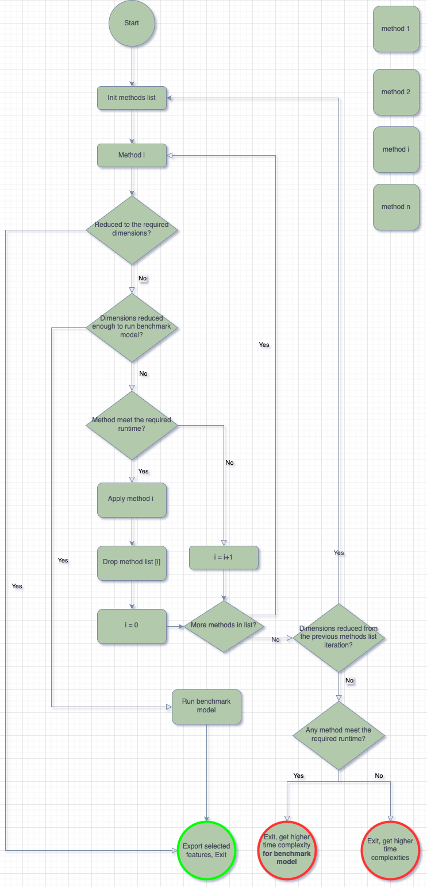

# SmartSelect: Ensemble-Based Feature Selection for Machine Learning

A master's thesis project exploring an ensemble approach to feature selection, combining multiple methods to enhance model accuracy, robustness, and interpretability in machine learning tasks.

## Table of Contents

- [Introduction](#introduction)
- [Installation](#installation)
- [Usage](#usage)
- [Methodology](#methodology)
- [Results](#results)
- [License](#license)


## Introduction
In modern machine learning workflows, selecting the most relevant features from high-dimensional data is crucial for building efficient, interpretable, and high-performing models. Feature selection helps reduce overfitting, improve generalization, and decrease computational cost — especially in domains where datasets contain many potentially redundant or irrelevant features.

This project, developed as part of a master's thesis, proposes an ensemble-based feature selection framework that leverages the strengths of multiple selection strategies — including statistical filters, wrapper methods, and embedded techniques. By combining diverse approaches, the ensemble aims to produce more stable and accurate feature subsets than any individual method alone.

The framework is designed to be modular, extensible, and applicable to both classification and regression problems. It includes tools for ranking, aggregating, and visualizing selected features across methods, with the goal of assisting data scientists in building better models with fewer, more meaningful inputs.

## Installation

1. Make sure you are using **Python  3.11.10** (or compatible).
2. It is recommended to use a virtual environment:

```bash
python3 -m venv venv
source venv/bin/activate  # On Windows: venv\Scripts\activate
```
3. Install dependencies:
```bash
pip install -r requirements.txt
```

## Usage

### Input Format

The input data must be a csv file, and follow this structure:

- **Target column**: *(str)* A single column representing the prediction target.
- **Optional columns**:
  - **`drop_cols`** *(List[str])*: Columns that must be excluded from model training (e.g., identifiers, known leakage).
  - **`index_cols`** *(List[str])*: Columns used for indexing or metadata, not included in training or selection.
- All the other columns will be considered as features for selection.

> The model will automatically ignore all columns listed in `drop_cols` and `index_cols`.

---

### Configuration

This section defines all required and optional parameters for running the feature selection pipeline.

All configuration parameters are defined in the `config.py` file.

---

#### Input Location

- **`input_path`** *(str)*: Path to the input data file (e.g., CSV or Parquet).

---

#### Feature Count

Specify how many features to select:

- **`k_features`** *(int or None)*: Absolute number of features to select.
- **`percent_features`** *(float or None)*: Percentage (e.g., `0.2` for 20%) of features to select.

> ⚠️ **Exactly one** of `k_features` or `percent_features` must be `None`.  
If both are set, the model raises an error.  
If both are `None`, the default is `sqrt(n_samples)`.

---

#### Column Settings

- **`target_col`** *(str)*: Name of the target column.
- **`drop_cols`** *(List[str])*: List of forbidden feature columns.
- **`index_cols`** *(List[str])*: List of index/metadata columns.

---

#### Model Type

- **`model_type`** *(str)*: Type of task to solve — must be either `"classification"` or `"regression"`.
- **`Anomaly Detection (Not yet supported)`** *(bool)*: Currently support only False. Placeholder for future development.

---

#### Time Complexity Controls

To manage computational cost during feature selection:

```python
time_complexities = {
    "max_time_indexed_methods": int, # Indexed methods: Fast methods like correlation
    "max_time_non_indexed_methods": int # Non-indexed methods: Slower methods like Random Forest or RFE
}
```
- **`benchmark_model_max_time`** Maximum time cost allowed for the benchmark model, which runs once at the final stage. Multiplied by the number of ensemble models

#### Random Seed

random_seed (int or None): Sets the random seed for reproducibility. If None, no specific seed is used.
---

### Basic Example

To see the feature selection pipeline in action, check out the example notebook:

📓 [`example_usage.ipynb`](src/notebooks/example_usage.ipynb)

This notebook demonstrates:

- How to configure the pipeline using `config.py`
- What the expected input format looks like
- How to run the selection process
- How to inspect the selected features

> Tip: Make sure to run the notebook from the project root directory so it can access modules like `config.py`.  
If needed, add the following to the first cell to enable imports:

```python
import sys, os
sys.path.append(os.path.abspath(".."))
```


## Methodology

This system performs feature selection using an ensemble of methods, guided by constraints and preferences provided in a configuration file. These include runtime budgets, target number of features, task type (classification or regression), and more.

The overall process follows these steps:

### Initialization:
Based on the configuration, a list of feature selection methods is defined. The methods ranked by quality, and associated with an estimated runtime cost.

### Iterative Filtering:

Iterative Filtering
The system iterates through the list of methods in order of quality:

If a method's estimated runtime fits within the constraints (time_complexities), it is executed on the current feature set.

The output is a reduced feature set, which becomes the input for the next method.

If the method's cost exceeds the allowed limit, it is skipped, but will be re-evaluated immediately after the next method is applied.

Each method is required to retain at least 50% of the input features it receives.

After we have finished going through the entire list, we do another iteration over the entire list, and so on recursively.

### Stopping Conditions:


The iteration continues until one of the following occurs:

- The number of features reaches the target specified by the user (k_features or percent_features).

- The feature space has been reduced enough to allow a heavier benchmark model to run within its own complexity constraint (as defined in the config).

- None of the selection methods manage to meet the runtime requirement. In this case, the program will terminate and prompt the user to increase the allowed complexity.

- The selection methods stop making progress (i.e., no further reduction in features), and the number of features is still too high for the benchmark model to run within its complexity limit. The program will terminate and ask the user to increase the benchmark model's complexity constraint.
### Benchmark Model Selection:

If the system reaches a point where a complex supervised model (e.g., gradient boosting) can be run:

It re-applies all feature selection methods from the original list, each constrained to select exactly the desired number of features.

For each resulting feature set, a benchmark model is trained and evaluated.

The final selected feature set is the one that achieved the highest performance (e.g., accuracy, F1, RMSE) on the benchmark model.

This methodology ensures a balance between performance and efficiency, leveraging strong selectors where possible while respecting resource constraints. The iterative ensemble design helps avoid overfitting to any single method or metric.

### Feature Selection Workflow:




## Results

Each feature selection run is assigned a unique identifier using a UUID. This run ID is used to generate and store the output files:

### Output Files

- 🖼️ **Flow Diagram:**  
  A visual summary of the executed feature selection process is saved as:
  
feature_selection_{run_id}.png

- 📄 **Selected Features File:**  
The list of selected features is saved as a serialized object, named:  
best_features_{run_id}


> ⚠️ **Note on Flow Complexity:**  
> The flow diagram visualizes the sequence of feature selection methods used, along with their normalized time complexities.  
> Complexity is **not shown in absolute terms**, but is normalized relative to the input dimensionality at each stage of the process.

- **Example Results:**

You can find example output files in the [`example_results/`](example_results/) folder:

- [Flow Diagram](example_results/feature_selection_cd08d06fcb26444ea186841fe94844f3.png)
- [Selected Features Output](example_results/best_features_cd08d06fcb26444ea186841fe94844f3)

## License

This project is for academic purposes only and is not licensed for commercial use.

